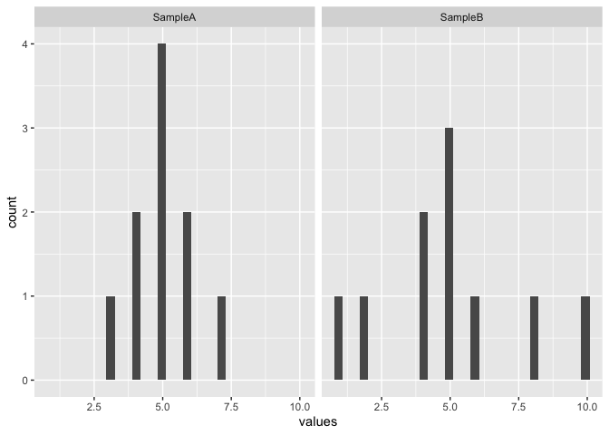
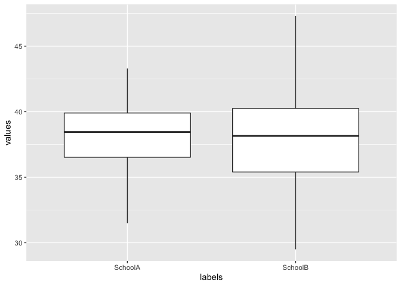

母集団と標本
================

<!-- 編集時のチェックリスト -->
<!-- - [ ] 目的と課題は明確か -->
<!-- - [ ] 説明を聞いていて不明な語句はなかったか -->
<!--
目的
- [ ] 仮説検証時のツッコミを経験し、計画の大切さを説明できる
- [ ] 手元のデータから母集団に関して言及するために必要なズレを説明できる
-->

## Ch02.md の目標

-   用語を整理する(母集団と標本, 無作為抽出,
    母平均$\mu$と母分散$\sigma^2$)
    -   母集団から標本を無作為抽出 -\> (母分散を推定) -\>
        母平均の幅を推定

## 2.1 母集団と標本の関係

> 教訓: データの選択（サンプリング）で「本当のデータ」からはズレる。
> 本当のデータを取得できない現実で本当の値(平均や分散)の議論を進めるためには
> 手元のデータから本当の平均値ズレを推定したい。

Ch01では以下の教訓があったが、これを教科書(p.10)に沿った言い方に変えると…

> **母集団**の性質（**母平均**、**母分散**）を**標本**から**推定**
> (統計の三大目的)したい

となる。**太字**の用語は抑えておきましょう。これらの推定ができると
本当のデータを取得できない現実での議論を進められる、ということになります。
その際、標本(サンプル)の取得方法に関して
**ランダムサンプリング**と**トレードオフ**の話もしてくれています。

なお、母集団と標本の性質を分けてか表記したいとき、
母平均を$\mu$、母分散を $\sigma^2$ と表記します。
対して標本(母集団の性質を推定するためのデータ) の標本平均を
$\bar{X}$、標本分散 を $s^2$ と表記します。

## 2.2 標本の性質

p.13以降は徐々に数式が増えていくのでRのコードで補足していきます。
データは以下のように準備できます。

``` r
# <- で値を代入、 cはconcatenateのcなので、カッコ内を平にする。
A <- c(3, 4, 4, 5, 5, 5, 5, 6, 6, 7)
B <- c(1, 2, 4, 4, 5, 5, 5, 6, 8, 10)
# repはrepeatなので、 rep("SampleA", 10) の意味は...?
df1 <- data.frame(
  values = c(A, B),
  labels = c(rep("SampleA", 10), rep("SampleB", 10))
)
# 最初の6行を見せて、という意味
head(df1, 6)
```

    ##   values  labels
    ## 1      3 SampleA
    ## 2      4 SampleA
    ## 3      4 SampleA
    ## 4      5 SampleA
    ## 5      5 SampleA
    ## 6      5 SampleA

このデータは以下のように可視化できます。

``` r
library(ggplot2)
ggplot(df1) +
  facet_wrap(. ~ labels) +
  geom_histogram(aes(x = values))
```

    ## `stat_bin()` using `bins = 30`. Pick better value with `binwidth`.

<!-- -->

データを触れるようになったところで、2.2.1に移りましょう。
SampleAもSampleBも5あたりに中心があるけれど、
ばらつきはSampleBの方が大きいですね。

``` r
# https://whatalnk.github.io/stat-intro-by-r-tkd/Chap02.html
A <- c(
  43.3, 43.1, 42.6, 42.4, 42.2, 41.8, 41.7, 41.6, 41.5, 41.4,
  40.8, 40.6, 40.5, 40.4, 40.4, 40.3, 40.2, 39.9, 39.9, 39.8,
  39.7, 39.6, 39.6, 39.5, 39.4, 39.3, 38.9, 38.9, 38.8, 38.8,
  38.7, 38.7, 38.6, 38.6, 38.5, 38.4, 38.3, 38.2, 38.1, 38.1,
  37.6, 37.4, 37.1, 37.8, 37.6, 37.5, 37.4, 37.3, 37.2, 37.1,
  37.1, 36.6, 36.5, 36.5, 36.4, 36.3, 36.2, 36.1, 35.4, 35.3,
  35.2, 35.1, 35.1, 34.7, 34.3, 34.2, 33.2, 33.1, 32.7, 31.5
)
B <- c(
  47.3, 46.1, 45.6, 45.1, 44.5, 44.4, 43.7, 42.6, 42.5, 42.5,
  41.4, 41.8, 41.6, 41.5, 40.7, 40.5, 40.4, 40.3, 40.1, 40.1,
  39.9, 39.8, 39.7, 39.6, 39.6, 39.5, 39.4, 38.9, 38.8, 38.8,
  38.7, 38.7, 38.6, 38.4, 38.2, 38.1, 38.1, 37.8, 37.7, 37.5,
  37.5, 37.4, 37.3, 37.3, 37.1, 36.8, 36.8, 36.7, 36.6, 36.4,
  36.2, 35.4, 35.4, 35.4, 35.3, 35.2, 34.9, 34.8, 34.7, 34.7,
  33.9, 33.8, 33.7, 33.3, 33.1, 32.8, 32.5, 32.1, 31.7, 29.5
)
df2 <- data.frame(
  values = c(A, B),
  labels = c(rep("SchoolA", length(A)), rep("SchoolB", length(B)))
)
ggplot(df2) +
  facet_wrap(. ~ labels) +
  geom_histogram(aes(x = values))
```

    ## `stat_bin()` using `bins = 30`. Pick better value with `binwidth`.

<!-- -->

### 2.2.1 中心や位置を表す指標

平均値を $\bar{X}=1/n = \Sigma_{i=1}^{n}X_i$ としています。
人によてはRのコードで見たほうが理解しやすいかもしれません。
`X_A_bar`($\bar{X}_A$) は以下のように求められます。

``` r
# ベクトルに対して一度に真偽値を求められる
print(df2$labels=="SchoolA")
```

    ##   [1]  TRUE  TRUE  TRUE  TRUE  TRUE  TRUE  TRUE  TRUE  TRUE  TRUE  TRUE  TRUE
    ##  [13]  TRUE  TRUE  TRUE  TRUE  TRUE  TRUE  TRUE  TRUE  TRUE  TRUE  TRUE  TRUE
    ##  [25]  TRUE  TRUE  TRUE  TRUE  TRUE  TRUE  TRUE  TRUE  TRUE  TRUE  TRUE  TRUE
    ##  [37]  TRUE  TRUE  TRUE  TRUE  TRUE  TRUE  TRUE  TRUE  TRUE  TRUE  TRUE  TRUE
    ##  [49]  TRUE  TRUE  TRUE  TRUE  TRUE  TRUE  TRUE  TRUE  TRUE  TRUE  TRUE  TRUE
    ##  [61]  TRUE  TRUE  TRUE  TRUE  TRUE  TRUE  TRUE  TRUE  TRUE  TRUE FALSE FALSE
    ##  [73] FALSE FALSE FALSE FALSE FALSE FALSE FALSE FALSE FALSE FALSE FALSE FALSE
    ##  [85] FALSE FALSE FALSE FALSE FALSE FALSE FALSE FALSE FALSE FALSE FALSE FALSE
    ##  [97] FALSE FALSE FALSE FALSE FALSE FALSE FALSE FALSE FALSE FALSE FALSE FALSE
    ## [109] FALSE FALSE FALSE FALSE FALSE FALSE FALSE FALSE FALSE FALSE FALSE FALSE
    ## [121] FALSE FALSE FALSE FALSE FALSE FALSE FALSE FALSE FALSE FALSE FALSE FALSE
    ## [133] FALSE FALSE FALSE FALSE FALSE FALSE FALSE FALSE

``` r
# [行,列]を真偽値で指定できる。
print(df2[df2$labels=="SchoolA",])
```

    ##    values  labels
    ## 1    43.3 SchoolA
    ## 2    43.1 SchoolA
    ## 3    42.6 SchoolA
    ## 4    42.4 SchoolA
    ## 5    42.2 SchoolA
    ## 6    41.8 SchoolA
    ## 7    41.7 SchoolA
    ## 8    41.6 SchoolA
    ## 9    41.5 SchoolA
    ## 10   41.4 SchoolA
    ## 11   40.8 SchoolA
    ## 12   40.6 SchoolA
    ## 13   40.5 SchoolA
    ## 14   40.4 SchoolA
    ## 15   40.4 SchoolA
    ## 16   40.3 SchoolA
    ## 17   40.2 SchoolA
    ## 18   39.9 SchoolA
    ## 19   39.9 SchoolA
    ## 20   39.8 SchoolA
    ## 21   39.7 SchoolA
    ## 22   39.6 SchoolA
    ## 23   39.6 SchoolA
    ## 24   39.5 SchoolA
    ## 25   39.4 SchoolA
    ## 26   39.3 SchoolA
    ## 27   38.9 SchoolA
    ## 28   38.9 SchoolA
    ## 29   38.8 SchoolA
    ## 30   38.8 SchoolA
    ## 31   38.7 SchoolA
    ## 32   38.7 SchoolA
    ## 33   38.6 SchoolA
    ## 34   38.6 SchoolA
    ## 35   38.5 SchoolA
    ## 36   38.4 SchoolA
    ## 37   38.3 SchoolA
    ## 38   38.2 SchoolA
    ## 39   38.1 SchoolA
    ## 40   38.1 SchoolA
    ## 41   37.6 SchoolA
    ## 42   37.4 SchoolA
    ## 43   37.1 SchoolA
    ## 44   37.8 SchoolA
    ## 45   37.6 SchoolA
    ## 46   37.5 SchoolA
    ## 47   37.4 SchoolA
    ## 48   37.3 SchoolA
    ## 49   37.2 SchoolA
    ## 50   37.1 SchoolA
    ## 51   37.1 SchoolA
    ## 52   36.6 SchoolA
    ## 53   36.5 SchoolA
    ## 54   36.5 SchoolA
    ## 55   36.4 SchoolA
    ## 56   36.3 SchoolA
    ## 57   36.2 SchoolA
    ## 58   36.1 SchoolA
    ## 59   35.4 SchoolA
    ## 60   35.3 SchoolA
    ## 61   35.2 SchoolA
    ## 62   35.1 SchoolA
    ## 63   35.1 SchoolA
    ## 64   34.7 SchoolA
    ## 65   34.3 SchoolA
    ## 66   34.2 SchoolA
    ## 67   33.2 SchoolA
    ## 68   33.1 SchoolA
    ## 69   32.7 SchoolA
    ## 70   31.5 SchoolA

``` r
X_A = df2[df2$labels=="SchoolA", "values"]
X_A_bar = sum(X_A)/length(X_A)
X_A_bar
```

    ## [1] 38.23714

課題: `X_B_bar` を求めてみてください。

``` r
# X_B_bar
print(df2$labels=="SchoolB")
```

    ##   [1] FALSE FALSE FALSE FALSE FALSE FALSE FALSE FALSE FALSE FALSE FALSE FALSE
    ##  [13] FALSE FALSE FALSE FALSE FALSE FALSE FALSE FALSE FALSE FALSE FALSE FALSE
    ##  [25] FALSE FALSE FALSE FALSE FALSE FALSE FALSE FALSE FALSE FALSE FALSE FALSE
    ##  [37] FALSE FALSE FALSE FALSE FALSE FALSE FALSE FALSE FALSE FALSE FALSE FALSE
    ##  [49] FALSE FALSE FALSE FALSE FALSE FALSE FALSE FALSE FALSE FALSE FALSE FALSE
    ##  [61] FALSE FALSE FALSE FALSE FALSE FALSE FALSE FALSE FALSE FALSE  TRUE  TRUE
    ##  [73]  TRUE  TRUE  TRUE  TRUE  TRUE  TRUE  TRUE  TRUE  TRUE  TRUE  TRUE  TRUE
    ##  [85]  TRUE  TRUE  TRUE  TRUE  TRUE  TRUE  TRUE  TRUE  TRUE  TRUE  TRUE  TRUE
    ##  [97]  TRUE  TRUE  TRUE  TRUE  TRUE  TRUE  TRUE  TRUE  TRUE  TRUE  TRUE  TRUE
    ## [109]  TRUE  TRUE  TRUE  TRUE  TRUE  TRUE  TRUE  TRUE  TRUE  TRUE  TRUE  TRUE
    ## [121]  TRUE  TRUE  TRUE  TRUE  TRUE  TRUE  TRUE  TRUE  TRUE  TRUE  TRUE  TRUE
    ## [133]  TRUE  TRUE  TRUE  TRUE  TRUE  TRUE  TRUE  TRUE

``` r
# [行,列]を真偽値で指定できる。
print(df2[df2$labels=="SchoolA",])
```

    ##    values  labels
    ## 1    43.3 SchoolA
    ## 2    43.1 SchoolA
    ## 3    42.6 SchoolA
    ## 4    42.4 SchoolA
    ## 5    42.2 SchoolA
    ## 6    41.8 SchoolA
    ## 7    41.7 SchoolA
    ## 8    41.6 SchoolA
    ## 9    41.5 SchoolA
    ## 10   41.4 SchoolA
    ## 11   40.8 SchoolA
    ## 12   40.6 SchoolA
    ## 13   40.5 SchoolA
    ## 14   40.4 SchoolA
    ## 15   40.4 SchoolA
    ## 16   40.3 SchoolA
    ## 17   40.2 SchoolA
    ## 18   39.9 SchoolA
    ## 19   39.9 SchoolA
    ## 20   39.8 SchoolA
    ## 21   39.7 SchoolA
    ## 22   39.6 SchoolA
    ## 23   39.6 SchoolA
    ## 24   39.5 SchoolA
    ## 25   39.4 SchoolA
    ## 26   39.3 SchoolA
    ## 27   38.9 SchoolA
    ## 28   38.9 SchoolA
    ## 29   38.8 SchoolA
    ## 30   38.8 SchoolA
    ## 31   38.7 SchoolA
    ## 32   38.7 SchoolA
    ## 33   38.6 SchoolA
    ## 34   38.6 SchoolA
    ## 35   38.5 SchoolA
    ## 36   38.4 SchoolA
    ## 37   38.3 SchoolA
    ## 38   38.2 SchoolA
    ## 39   38.1 SchoolA
    ## 40   38.1 SchoolA
    ## 41   37.6 SchoolA
    ## 42   37.4 SchoolA
    ## 43   37.1 SchoolA
    ## 44   37.8 SchoolA
    ## 45   37.6 SchoolA
    ## 46   37.5 SchoolA
    ## 47   37.4 SchoolA
    ## 48   37.3 SchoolA
    ## 49   37.2 SchoolA
    ## 50   37.1 SchoolA
    ## 51   37.1 SchoolA
    ## 52   36.6 SchoolA
    ## 53   36.5 SchoolA
    ## 54   36.5 SchoolA
    ## 55   36.4 SchoolA
    ## 56   36.3 SchoolA
    ## 57   36.2 SchoolA
    ## 58   36.1 SchoolA
    ## 59   35.4 SchoolA
    ## 60   35.3 SchoolA
    ## 61   35.2 SchoolA
    ## 62   35.1 SchoolA
    ## 63   35.1 SchoolA
    ## 64   34.7 SchoolA
    ## 65   34.3 SchoolA
    ## 66   34.2 SchoolA
    ## 67   33.2 SchoolA
    ## 68   33.1 SchoolA
    ## 69   32.7 SchoolA
    ## 70   31.5 SchoolA

``` r
X_A = df2[df2$labels=="SchoolA", "values"]
X_A_bar = sum(X_A)/length(X_A)
X_A_bar
```

    ## [1] 38.23714

-   Rとベクトルの計算

``` r
B <- c(1, 2, 4, 4, 5, 5, 5, 6, 8, 10)
sqrt(sum((mean(B) - B)^2)/9)
```

    ## [1] 2.624669

``` r
sd(B)
```

    ## [1] 2.624669

``` r
data = c(5.1, 7.4, 10.3, 9.2, 6.5, 6.1, 7.9, 8.4, 8.1, 9.4)
# 2.1
sqrt(var(data)) == sd(data)
```

    ## [1] TRUE

``` r
sd(data)
```

    ## [1] 1.607068

``` r
# 2.2
n = length(data)
d.mean = sum(data)/n
d.mean
```

    ## [1] 7.84

``` r
sqrt(sum((d.mean - data)^2) / (n-1))
```

    ## [1] 1.607068

その他、中央値や最頻値もありますが統計ではあまり使いません。
Rなら箱ひげ図も簡単に描けます。

``` r
ggplot(df2) +
  geom_boxplot(aes(x = labels, y=values))
```

<!-- -->

### 2.2.2 ばらつきを表す指標

<!-- 2012 年度の高 1 生より，データの分析(統計学) が必修単位として導入された -->
<!-- 高校はクラス間の比較などの全数調査になっている。不偏分散が新しい -->

標本分散は小さい方向へ偏るので、 1/n ではなく 1/(n-1)
をかけて偏りをなくす （より大きい、偏るのない「不偏」な分散とする）
コラム2.3を参照したい。

``` r
X_A = df1[df1$labels=="SampleA", "values"]
n = length(X_A)
# 偏差和
sum(X_A - mean(X_A))  # ほぼ0
```

    ## [1] 0

``` r
# 平方和(ただし、データの数だけ増えるし、単位が面積になっている)
sum((X_A - mean(X_A))^2)  # 式(2.2)
```

    ## [1] 12

``` r
# 標本分散(まだ単位は面積)
sum((X_A - mean(X_A))^2)/(n-1)
```

    ## [1] 1.333333

``` r
# 標準偏差(平均的なばらつき)
sqrt(sum((X_A - mean(X_A))^2)/(n-1))
```

    ## [1] 1.154701

``` r
sd(X_A) == sqrt(sum((X_A - mean(X_A))^2)/(n-1))  # Rのsdはn-1バージョン
```

    ## [1] TRUE

このsdの値は色々なところに使える。値が正規分布に従うとき、
+-2sdは95%になる。

ちゃんともとのグラフのばらつき具合を反映できていることを確認する

## 2.3 演習問題

R初出
