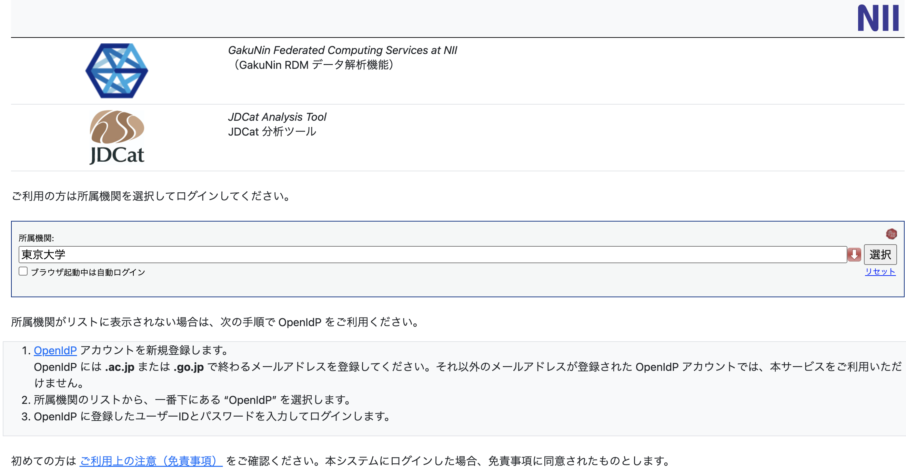

```{r setup, include=FALSE}
knitr::opts_chunk$set(echo = TRUE)
library(ggplot2)
library(readr)
library(dplyr)
```

# 『Rで学ぶ統計学入門』勉強会

## 概要

-   『Rで学ぶ統計学入門』を教科書として統計学の基本(t検定まで)と
    初歩的、応用（8章までと補足）を進める。

-   ゴールは統計の全体像を掴んで、とりあえず与えられたデータに対して
    適切な手法を選択、実行できるようになること

-   **統計学の厳密な部分には立ち入らない**

    -   こういうケースで何をすればいいのか、の説明のみ
    -   より細かく知りたい場合は教科書の該当部分を参照

## 全体のアウトライン

Day0

-   **R/RStudio**

Day1

-   t検定
-   補足: t検定と線形モデル
-   ANOVA

Day2

-   GLM
-   ランダム構造
-   モデル選択

## R/RStudio

このチュートリアルはRStudioという、
Rを使いやすくする環境を使って進めていきます。

-   環境の確認
-   R/RStudio(Server)
-   チュートリアルの進め方

なおR自体の説明は教科書冒頭にあります(pp.1--2)

-   オープンソース
-   統計に強い
-   可視化も楽

事前に手を動かせる部分は手を動かしていただき、
もし環境構築やR自体に関する質問などがあれば事前に受け付ける
方向で進めさせていただければ、と思います。

## 環境の確認

1.  <https://binder.cs.rcos.nii.ac.jp/v2/gh/kishiyamat/r-stats-hands-on/main>
    にアクセス（アクセスするたびに環境が作られます。
    チュートリアルのたびにアクセスし、最新の状態にしていただければと思います。）
2.  NIIのウェブページで所属機関を[選択]し、ご自身の所属機関で認証
    (自分用の分析環境が新たに作られます。長くて5分ほどかかります)



1.  Files の右側にある New → RStudio をクリック (RStudio
    が新しいタブで開きます)


この次点では以下の「ペイン」が利用できます。

-   左の「Console」
-   右上の「Environment」
-   右下の「Files」


## R/RStudio(Server)

Rの実行(エラーがでたらページを再読み込みしてください)

-   Files から day0.Rmd を選択すると、左上に Editor Pane が開きます。
    ここまで読んできた内容(day0)が「マークダウン」という形式で書かれています。
-   Switch to visual markdown editor を選択（Switch to Visual Mode
    という ポップアップがでて来た場合は Use Visual Mode を選択）


そうすると、少しばかり見やすく、かつ実行できる状態の画面に変わります。
ここからはもともと読んでいたファイルではなく、
さきほど開いた左上のEditorペインで、Rを使いながら読み進めてください。

## Rの使い方

ここまでRStudioの画面を説明してきましたが、
ここからは「そもそもRとはなにか」の話をします。
おそらく手を動かすのが１番早いので、
まずは下のセル（灰色がかった部分）の
右上の緑▶をクリックしてみてください。

```{r}
# <- で変数に代入できます。変数の上書きはできるだけ避けましょう。
a <- 10
# 式をConsoleにコピペするもよし、右上の緑▶を押すもよし、
# Macは⌘エンター、WindowsはCtrlエンターもよし
x <- (5 + 3) * 2 - a / 5
# Environment で値をチェックできる
```

これで四則演算(`+-*/`)や代入(`<-`)、コメント(`#`)といった
基本的な機能は抑えられたかと思います。
もちろん、セルの中にコードを追記していただければ、
追記したコードも実行の対象になります。

つぎに「関数」の説明です。
関数は、入力をカッコ`()`に与えると出力を返します。
このように、関数は引数（ひきすう）を取り、 返り値を持ちます。

```{r}
# 数値列作成のc
d <- c(1, 2, 3, 4, 5, 6, 7, 8, 9, 10)
# 平均を求める mean
mean(d)
# (不偏)分散を求める
var(d)
# 標準偏差を求めるsd
sd(d)
```

以上でRStudioとRの事前準備は終わります。

## チュートリアルの進め方

-   配置は 左上に「Editor」、右上に「Environment」、
    左下に「Console」、右下に「Files」
-   Editorのファイルを実行しながら説明していく
-   質問があったら随時うけつけます。

質問がございましたら、
[kishiyama.t\@gmail.com](mailto:kishiyama.t@gmail.com)
までご連絡ください。 当日は、Day1.Rmd を Visual Editor Mode
で開いた状態を準備していただけると
幸いです。どうぞよろしくお願いいたします。

注意：この環境は練習用です。詳しくは
<https://meatwiki.nii.ac.jp/confluence/pages/viewpage.action?pageId=67614937>
をご参照ください。
